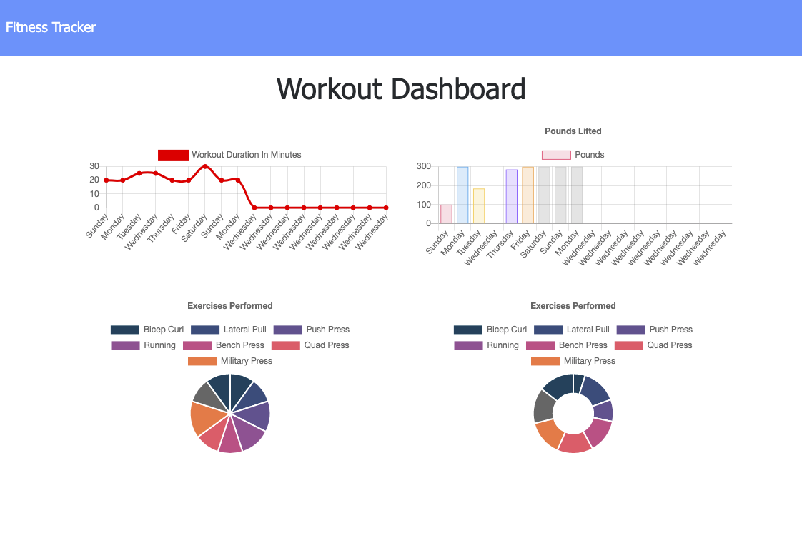
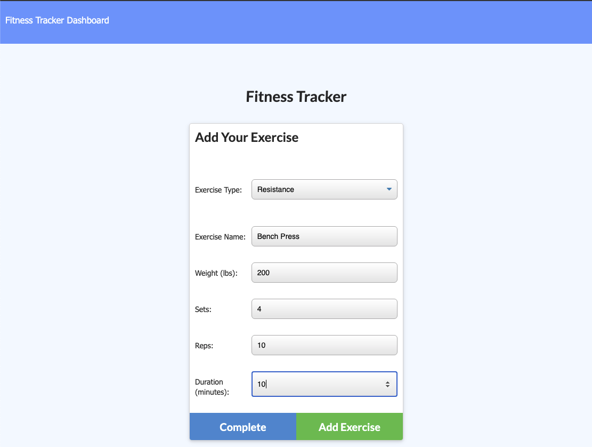

# Fitness-Tracker

## Project Description 
A simple but powerful application that allows you to track all of your fitness activities and converts them into easy to understand graphs! You can enter as many workouts as you want, and include the reps, duration, weight, and more within this app. 

## Installation 
Go to [https://limitless-bayou-09146.herokuapp.com/](https://limitless-bayou-09146.herokuapp.com/) and click "Add Workout" and start tracking workouts! Alternatively, you can clone this repo to your local device,  run `npm install` to install all dependencies, and then `run node server.js` in the CLI.

## License
This project is licensed under MIT License. Not sure what that means? Please check out [choosealicense.com/licenses/](https://choosealicense.com/licenses/) for more information.